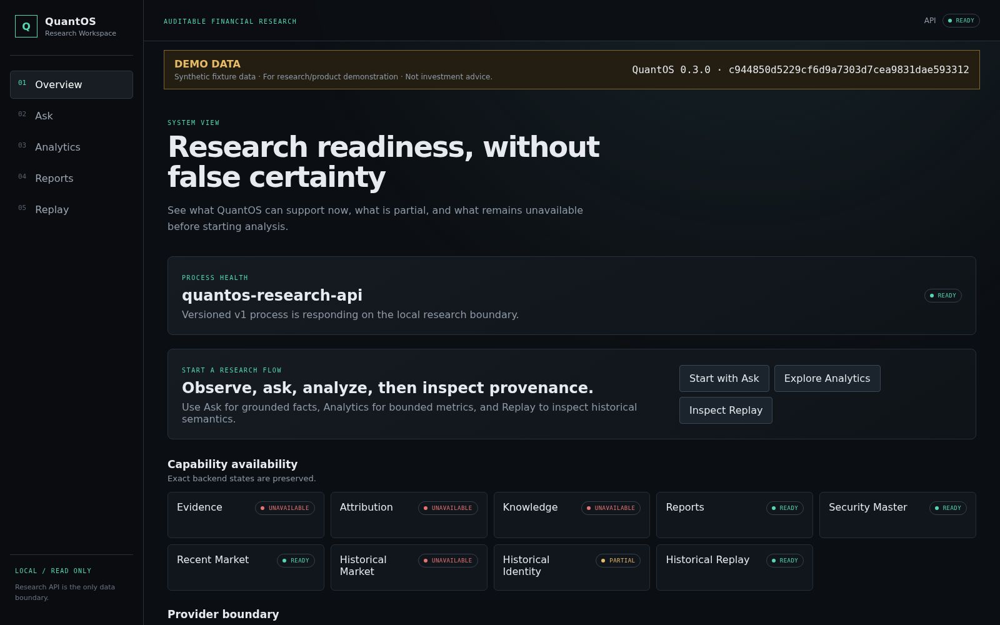
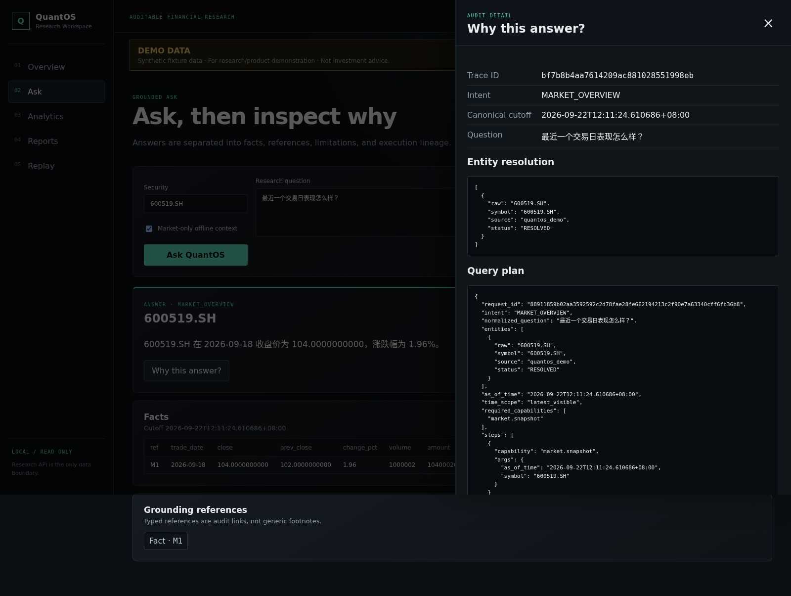
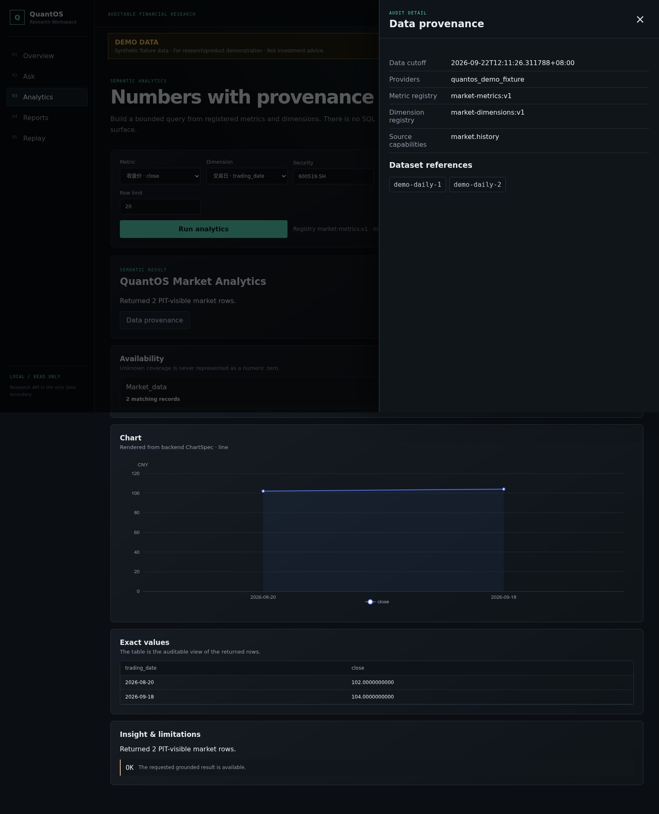
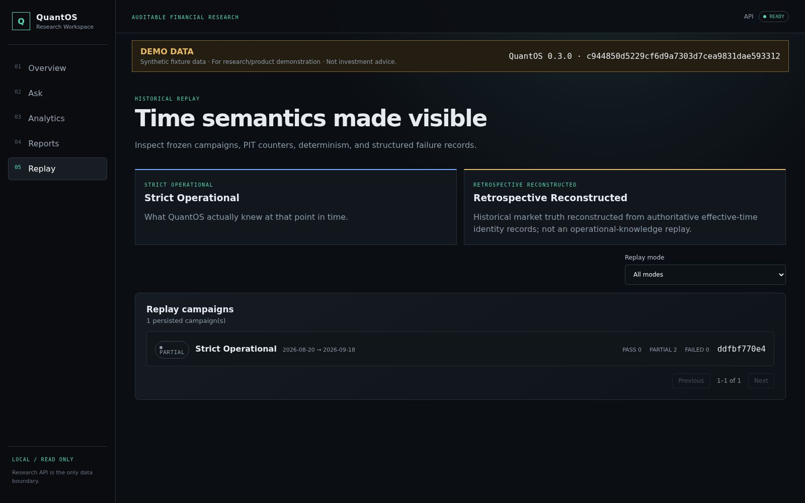

# QuantOS v0.3.0 — Local Auditable Research Workspace

QuantOS v0.3.0 packages the research core into one local workspace. Users can
ask grounded questions, inspect exact market facts and limitations, build
bounded analytics, trace every result to its provenance, and review PIT-safe
historical replay without opening a database or contacting a provider from the
browser.

## Highlights

- **One-command local start:** `quantos start` serves the Research API and
  production Workspace from one loopback URL with safe port fallback.
- **Offline Demo Mode:** `quantos start --demo` provides a deterministic,
  clearly labeled fixture without credentials, internet, or user data.
- **Grounded Ask:** answers retain facts, evidence references, reason codes,
  limitations, and an inspectable structured trace.
- **Bounded analytics:** seven registered market metrics and four dimensions
  produce charts, exact tables, and provenance with no SQL input surface.
- **Historical clarity:** strict operational replay and retrospective
  reconstruction remain visibly distinct.
- **Availability first:** missing data, zero matches, partial results, and
  failures have different product semantics.

## Install and try the offline Demo

The validated source-checkout path is:

```bash
git clone https://github.com/LIN-LOUIS/QuantOS.git
cd QuantOS
python -m pip install -e '.[dev]'
cd web && npm ci && npm run build && cd ..
quantos doctor --project-root .
quantos start --demo
```

QuantOS selects a safe loopback port, waits for the Research API, and opens the
Workspace. Demo Mode uses synthetic fixture data and requires no provider
credential or internet connection.

## Product preview









## Safety boundary

QuantOS is a research tool, not a trading system or investment adviser. It is
local-only by default, does not silently fetch providers during startup, and
does not allow the Workspace to access storage, credentials, or providers.

## Known limitations

- QuantOS is a local-first service and does not yet provide production
  authentication or multi-user deployment.
- Demo data is synthetic, intentionally small, and is not investment advice.
- Strict operational replay history accumulates from actual observation time;
  retrospective reconstruction has a different, explicitly labeled meaning.
- Historical Evidence and Knowledge coverage depends on PIT-valid persisted
  sources and may be unavailable.
- External providers can be unconfigured, unavailable, or rate-limited.
